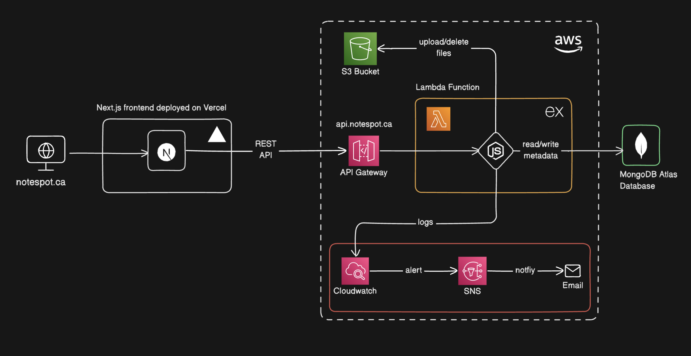

# Notespot

**Full-stack file sharing platform** designed for users to upload, download, and publicly share files of various formats (PDFs, docs, images, etc.), built with a focus on learning **scalable cloud infrastructure** and **modern backend development practices**.

### **Architecture Overview**

- **Frontend**: Built with **Next.js**, deployed on **Vercel**, delivering a easy to use interface for users.
- **Backend**: Developed using **Express.js** and deployed on **AWS Lambda** using the Serverless Framework, providing a scalable **REST API**
- **Authentication**: Integrated **Clerk** for user authentication and API security, ensuring only authorized users can access and manipulate data.
- **File Storage**: Files are uploaded to **AWS S3**, leveraging the scalability and performance of Amazon’s cloud storage.
- **Logging**: Logs are sent to **AWS CloudWatch**, enabling efficient monitoring and debugging of the application.
- **Database**: Metadata and related information is stored in **MongoDB Atlas**, enabling efficient data management and fast querying.

<picture>
  <source media="(prefers-color-scheme: dark)" srcset="sys-arch-dark-mode.png">
  <source media="(prefers-color-scheme: light)" srcset="sys-arch-light-mode.png">
  
</picture>
